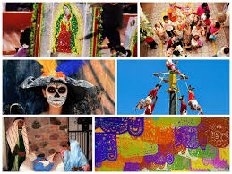
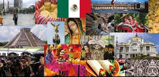
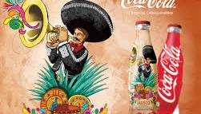
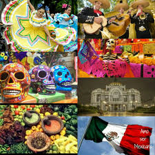
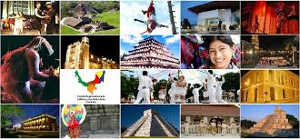
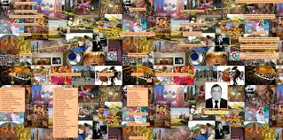
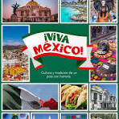
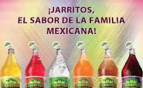

!DOCTYPE html> <!-- indica el tipo de docto-->
<HTML lang="es"><!--HTML es la etiqueta raíz, lang indica el lenguaje "es" de español-->
    <HEAD> <!--cabeza de documento-->
        <TITLE>Mi pag</TITLE><!--indica el título de la página-->
        <meta chaset="VTF-8"><!--Este metadato indica el tipo de caraacteres-->
        <link rel="stylesheet" href="miestilo.css"><!--Enlace documentos externos-->
    </HEAD><!-- inicia el cuerpo del documento-->
    <body><!-- inicia el cuerpo del documento-->
    
          <header><!--cabecera-->
            

                <h1> <!--titulo de la pag-->
                 

                RAMOS LOPEZ </h1>
            </header>
            <nav class="navbar"><!--Barra con botones-->
                 <ul><!--lista-->
                     <li><button class="btn-nav"><a href="Cultura_material.html" class="a"> Cultura material</a></button></li>
                      <li><button class="btn-nav"><a href="Cultura_inmaterial.html"class="a">Cultura inmaterial</a></button></li>
                       <li><button class="btn-nav"><a href="Cultura_popular_y_moderna.html"class="a">Cultura popular y moderna</a></button></li>
                        <li><button class="btn-nav"><a href="Cultura_indígena.html"class="a">Cultura indígena:</a></button></li>
                         <li><button class="btn-nav"><a href="Cultura_mestiza.html"class="a">Cultura mestiza:</a></button></li>
                
                    </ul>
                 
          </nav>
          <dir class ="contenedor">
          <article class ="articulo"><h2> Cultura mexicana  </h2><!--titulo del articulo-->
            

               
                La cultura de México refleja la complejidad de su realidad presente, de su pasado histórico y de su trayectoria hacia el futuro.
                En lo que se ha dado a llamar los mexicanos, su identidad nacional, influyen elementos culturales de las más diversas índoles: 
                lo moderno, lo antiguo y lo reciclado. La forma de vida en México incluye muchos aspectos de los pueblos prehispánicos del período virreinal.
                Está emparentada con las costumbres del resto de los países hispanoamericanos
                

            <aside class="programada">
                <h3>
                    
                 
                  
                  
                 </h3><!--barra lateral-->
                
 
           La cultura mexicana es rica y diversa, con influencias indígenas, coloniales, afrodescendientes, y modernas, lo que le da una complejidad única.
                       Se puede clasificar de varias maneras, dependiendo del enfoque:
                       por sus tradiciones, costumbres, manifestaciones artísticas, gastronomía, música, danzas, religión, etc.
                       A continuación, te presento algunas de las principales partes de la cultura mexicana
                        es un rico mestizaje de influencias indígenas prehispánicas, 
                     la colonización española y otras corrientes culturales, que se manifiestan en su vibrante gastronomía 
                    (reconocida por la UNESCO), su diversa música (mariachi, banda, etc.),
                     el arte (con énfasis en lo cotidiano y artesanal), y tradiciones únicas como el Día de Muertos. 
                     El país cuenta con una gran riqueza arqueológica y un patrimonio cultural diverso que incluye lenguas indígenas, 
                    fiestas religiosas como la Semana Santa y eventos como la Guelaguetza.    
                 
<!--informacion cpmplementaria-->
                 <aside class="programada">
                    <h4>
                 
                 
                  
                   
                  
                    
                    </h4>
                    <aside class="programada">
                        <h5> 
                            
                        </h5>
            </aside>
        
  </dir>
        <footer class="pie"> 19/09/2025</footer><!--Este es el pie de la pag-->
        
        </body>
</HTML>
